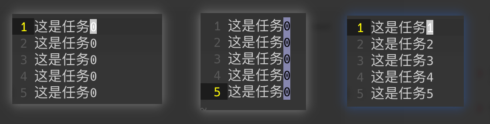
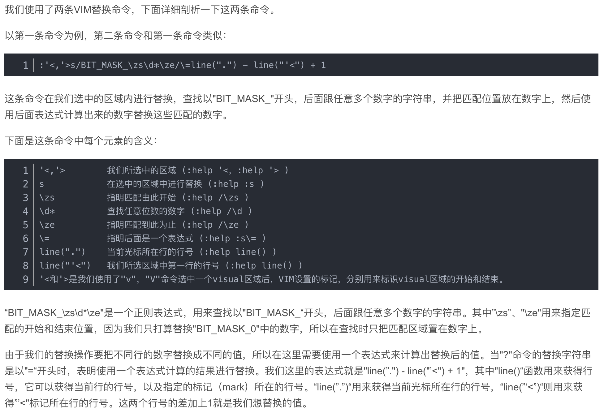

## 使用技巧

### 数值处理

#### 快捷键

```ad-note
title: 传统 Vim 与 Obsidian 中的 Vim 可用，VSCode Vim 不可用（有可能是快捷键配置问题屏蔽了，后面来看）

补充说明：确实是 VS Code 中快捷键屏蔽问题，不过需要手动开启。
```

- 数字自增：Ctrl + A
- 数字自减：Ctrl + X

#### 使用 put 和 range 来快速生成数字

> 只有传统 vim 可用

在所在行的下一行开始，生成 0-4 的数字

```vim
:put=range(5)
```

输出：

```text
0
1
2
3
4
```

你也可以通过一些变量来控制排序以及步长，比如：

生成 1-10 之间的奇数（升序，包括 1）：

```vim
:put=range(1,10,2)
```

输出：

```text
1
3
5
7
9
```

生成 10-1 之间的偶数（降序，包括 10）：

```vim
:put=range(10,1,-2)
```

```text
10
8
6
4
2
```

#### 快速增加已有数字列的值

三步即可，如下：

- 第一步：创建五个「这是任务 0」
- 第二步：光标移动到第一个 0 上，通过 Ctrl + V 进入 V-BLOCK 模式，向下选择其他的 0
- 第三步：先按下字母 `g`，然后按下快捷键 Ctrl + A，怎样？是不是很神奇 😙



#### 在行内指定位置添加数字列

> 感觉有点麻烦，算是扩展下知识吧，原理也还是通过找匹配项的操作实现的，那有可能某些行没有这个通用的匹配项不就匹配不到了，不如先进入 V-BLOCK 在后面添加一个 0 或者你想要开始递增的数值，然后使用上面的第三种方式一下就搞定了

命令：

```vim
:'<,'>s/{这是个变量，你想要匹配什么就填什么}\zs\d*\ze/\=line(".")-line("'<") + 1
```

```ad-note
title: TODO: 下面是别人的解析描述，有时间仔细看下，现在没兴趣，能用就行
```


